## Hi, I'm Luca 👋

Ex-Robotics Olympiad turned founder/VC. Built hardware, software, and everything in-between.

📍 San Francisco &nbsp;|&nbsp; 🌐 [creativemotion.io](https://creativemotion.io/)

---

## Projects

### 🎮 [Partly Games](https://partly.games/)
> *Jackbox-style party games you can build and deploy in seconds.*

Players use their phones as controllers — one shared screen runs the game. Visit the launcher, pick a template, and a dedicated game server spins up in ~10 seconds via Fly Machines. The Node.js backend is a pure relay (no game logic) — all logic runs on the host device via Godot 4 WASM. A pool manager keeps machines pre-warmed per template so cold starts drop from 6 minutes to 10 seconds. Machines auto-destroy after 20 min idle and are replaced automatically.

Ships with two templates: **Brainstorming Party** (Quiplash-style prompt + vote) and **The Villa** (Mafia-style social deduction with AI-generated tabloid headlines via Claude).

`Node.js` `WebSockets` `Godot 4 WASM` `Python` `Claude AI` `Fly Machines` `Docker` `Pool Manager`

---

### 🏨 Coliving Hive Scheduler
> *Full-stack booking platform for a coliving and coworking community.*

Members book rooms, desks, and event spaces using a company credit system. Interactive floor plan editors show live desk availability. Admins manage inventory, lock calendar months, and edit all content live — no redeployment. Includes a full credit ledger (gift, track, allocate per company), drag-and-drop floor plan editors, Luma integration for event promotion, and access guides with photo attachments.

`React 18` `TypeScript` `Vite` `Tailwind CSS` `Shadcn UI` `Supabase` `PostgreSQL` `TanStack Query` `React Hook Form` `Zod`

---

### 🏠 [chat-property-whisperer](https://github.com/Lucastirbat/chat-property-whisperer)
> *Rental search, reimagined as a conversation.*

Skip the filter forms. Describe what you want — neighborhood vibe, budget, amenities — and the AI searches Zillow, Apartments.com, Realtor.com, and ApartmentList simultaneously via Apify MCP. Claude decides when to trigger searches, normalizes results across scraper formats, deduplicates, and surfaces the best matches in a unified feed streamed in real time.

`React 18` `TypeScript` `Node/Express` `Claude AI` `Apify MCP` `SSE` `Tailwind` `Shadcn UI`

---

### 🍷 Corks Wine Tasting App
> *QR-to-report tasting experience for wine bars.*

Guests scan a QR code, rate each wine on guided characteristics, and receive a personalized report by email at the end. A host integration screen ("put your phone down") paces the flow between pours. Built mobile-first with smooth Framer Motion transitions and Chart.js tasting profiles.

`Next.js` `TypeScript` `Tailwind CSS` `Zustand` `Framer Motion` `Chart.js` `SendGrid` `Headless UI`

---

### 📋 [project-mgmt-cm](https://github.com/Lucastirbat/project-mgmt-cm)
> *Lightweight project management at the edge.*

TypeScript-first project management tool — Vite on the frontend, Cloudflare Workers on the backend for near-zero latency with no cold starts. No servers to manage.

`TypeScript` `Vite` `Tailwind CSS` `Cloudflare Workers`

---

### 📰 [News_Frontend_NVDV](https://github.com/Lucastirbat/News_Frontend_NVDV)
> *Publishing interface for the NVDV news platform.*

PWA-ready frontend for NVDV's content editing workflow — journalists and editors create, manage, and publish stories through a clean interface. Offline-capable via service worker, deployed on GitHub Pages.

`React` `HTML` `PWA` `GitHub Pages`

---

### 🚀 [Mentors_RX](https://github.com/Lucastirbat/Mentors_RX)
> *Structured startup evaluation for mentors.*

A focused tool for mentors to score startups against consistent criteria — replacing ad-hoc feedback with structured ratings founders can actually act on.

`JavaScript` `CSS` `HTML`

---

